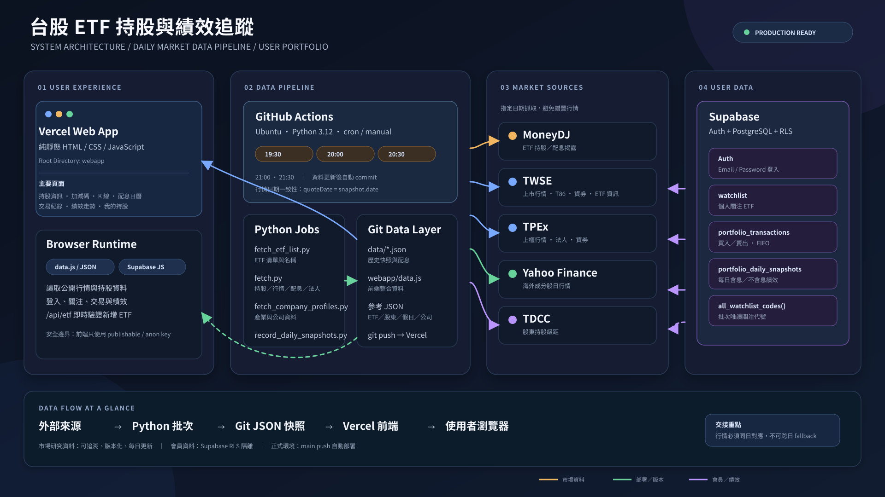
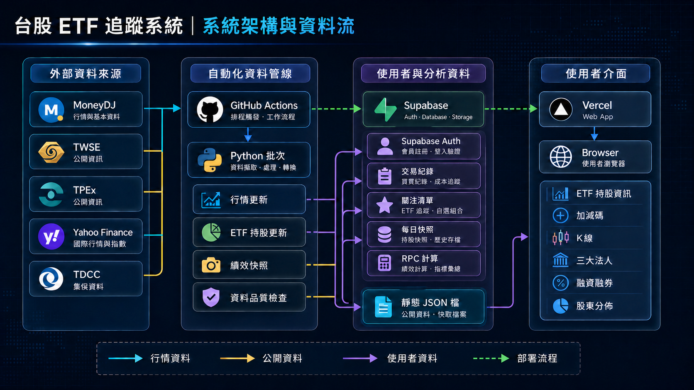

# 系統架構圖

這是 `tw-etf-tracker-v2.0` 的交接用系統架構圖。它把使用者介面、Vercel、GitHub Actions、Python 資料管線、外部資料來源與 Supabase 的責任邊界及資料流放在同一張圖上。

簡報預覽版：

## 讀圖方式

- 金色箭頭：ETF 市場資料與外部行情來源。
- 藍色箭頭：公開資料與前端展示流程。
- 綠色箭頭：GitHub Actions、版本化資料與部署流程。
- 紫色箭頭：Supabase 登入、個人資料與績效資料。
- 實線：主要資料流；虛線：觸發、回寫或批次關係。

## 系統分層

| 層級 | 技術 | 主要責任 |
| --- | --- | --- |
| 使用者介面 | HTML、CSS、JavaScript、SVG | 顯示持股、加減碼、配息、K 線、法人、資券、交易與績效 |
| 部署與 API | Vercel、Vercel Serverless Function、Python | 提供靜態網站，以及 `/api/etf` 單檔 ETF 即時查詢 |
| 公開資料管線 | GitHub Actions、Ubuntu、Python 3.12 | 定時抓取、解析、日期校驗、產生 JSON 與前端 `data.js` |
| 版本化資料 | GitHub、JSON | 保存歷史 ETF 快照、行情、配息與參考資料 |
| 會員資料 | Supabase Auth、PostgreSQL、RLS | 保存登入、關注 ETF、買賣交易與每日績效快照 |
| 外部來源 | MoneyDJ、TWSE、TPEx、Yahoo Finance、TDCC | 提供持股、配息、行情、法人、資券與股東分佈 |

## 關鍵資料流

1. GitHub Actions 依排程啟動 Python 批次。
2. `fetch.py` 從 MoneyDJ、TWSE、TPEx、Yahoo Finance 與 TDCC 取得資料。
3. 批次將資料寫入 `data/*.json`，並產生 `webapp/data.js`。
4. GitHub Actions 將變更 commit／push 到 `main`。
5. Vercel 偵測 `main` push，自動部署 `webapp`。
6. 瀏覽器讀取公開 JSON，並透過 Supabase Client 讀寫使用者資料。
7. `record_daily_snapshots.py` 讀取交易與市場快照，將每日績效寫入 Supabase。

## 重要安全與資料規則

- 前端只能使用 Supabase publishable／anon key。
- `SUPABASE_SERVICE_ROLE_KEY` 只能存在 GitHub Secrets。
- Supabase RLS 限制使用者只能存取自己的會員資料。
- 行情的 `quoteDate` 必須等於 ETF 快照的日期。
- 指定日期沒有行情時留空，禁止以其他日期行情代替。
- 本地端目前連接正式 Supabase；測試新增、修改、刪除交易前應使用測試專案。

## 相關文件

- [專案 README](../README.md)
- [GitHub Actions workflow](../.github/workflows/update-data.yml)
- [Supabase 每日績效 SQL](../supabase_portfolio_daily_snapshots.sql)
- [每日績效快照程式](../record_daily_snapshots.py)
